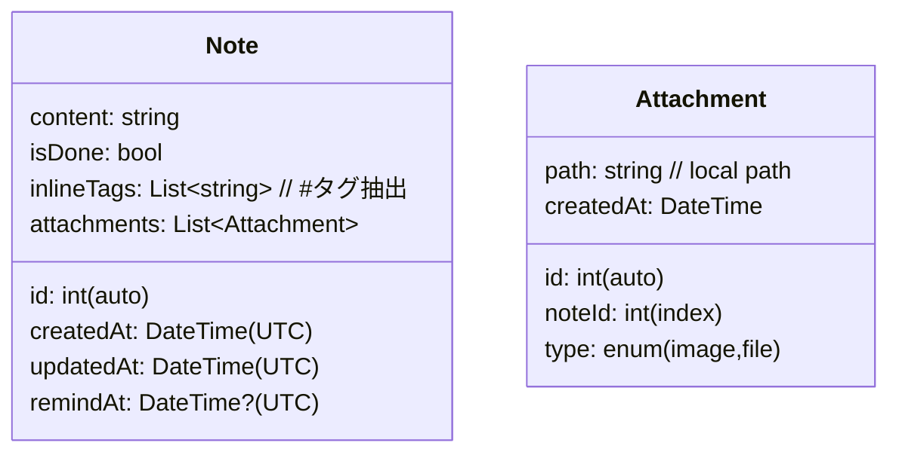

# KOTO 要件定義書 (MVP, rev 1s)

> 起動目標を **0.5秒 → 1.0秒** に緩和した改訂版。デュアルモード（「書く」「見る」）を核とした“最速の思考キャプチャ体験”を実現する。

---

## 0. 用語
- **KOTO**: 本アプリ名
- **Basic**: 無料プラン
- **Pro**: サブスクリプション課金プラン
- **Cold/Warm Start**: 初回/2回目以降の起動

---

## 1. 目的・背景
- 既存のメモ/タスクアプリは高機能化により“入力までの摩擦”が増大。  
- KOTOは **「書くは、一瞬。見るは、一目。」** を実現し、**起動から入力**までの最短経路を提供する。

### 1.1 目標 (Goals)
- **1秒以内に入力可能**（Warm/Cold いずれも）
- 思考の中断を最小化する **直感的ジェスチャ** と **ミニマルUI**
- **オフラインファースト**で高速・堅牢な保存
- Proで **同期/検索/添付/エクスポート** による継続価値を提供

### 1.2 非目標 (Non-Goals)
- 複雑なタグ/フォルダ階層管理
- 複数人コラボレーション
- Web版の同時提供（将来検討）

---

## 2. ターゲットユーザー
- 既存ツールに疲れて **“すぐ書きたい”** 人
- 「やる気はあるが、怠惰」なライト〜ミドル層
- モバイル中心、片手操作・移動中入力が多いユーザー

---

## 3. 価値提案
- **瞬間起動 + 即キーボード**で“思考停止しない”
- **ドラッグ3方向**だけ覚えれば完結（左=破棄 / 右=リマインド / 下=保存）
- 整理不要。**全文検索**と**インライン #タグ**で“あとから見つかる”

---

## 4. スコープ（MVP）
### 4.1 画面・UX
- **「書く」モード（デフォルト）**
  - 起動直後に白紙カード&キーボード自動表示
  - ジェスチャ: 左=破棄 / 右=リマインド（候補: 1h後/今夜/明日）/ 下=保存
  - 2本指タップで **Undo**
- **「見る」モード**
  - 時系列リスト（新しい順）、カード表示
  - 常駐全文検索バー（インライン `#` タグも対象）
  - 長押しメニュー: 完了 / リマインド変更 / 破棄

### 4.2 Pro/Basic の機能差
| 機能 | Basic (無料) | Pro (サブスク) |
|---|---|---|
| メモ保存 | 無制限 | 無制限 |
| リマインダー | 月5回 | 無制限 |
| 過去閲覧 | 最新50件 | 全件 |
| 全文検索 | × | 〇 |
| クラウド同期 | × | 〇 |
| 添付（画像/ファイル） | × | 〇 |
| データエクスポート（MD/JSON） | × | 〇 |

### 4.3 非機能（性能・品質）
- **起動KPI**  
  - Cold Start → 入力可能: **≤ 1.2 s (P50) / ≤ 1.6 s (P90)**  
  - Warm Start → 入力可能: **≤ 0.8 s (P50) / ≤ 1.2 s (P90)**
- **リスト描画**: 1万件でスクロール60fpsを目標（`SliverList + itemExtent`）
- **アプリサイズ**: iOS/Android それぞれ **≤ 35MB**（初期）
- **消費電力**: 背景処理は最小限、通知スケジューラはOS標準を活用

---

## 5. アーキテクチャ
### 5.1 方針
- **オフラインファースト**: **Isar** を単一の真実源（SSOT）として採用
- Pro時はバックグラウンドで **Firestore** と双方向同期（`updatedAt`ベースの **LWW**）
- デバイス間/タイムゾーン差を吸収するため、**UTC保存 / 端末TZ表示**

### 5.2 データモデル（Isar）

- インデックス: `updatedAt`, `remindAt`, `inlineTags`（検索最適化）
- 暗号化: 端末キーストア由来鍵でAES-256（ライブラリ/プラットフォーム標準機能を利用）

### 5.3 Firestore 構造（Pro）
```
/users/{uid}
  /notes/{noteId}
    content: string
    createdAt, updatedAt, remindAt: Timestamp(UTC)
    isDone: bool
    inlineTags: string[]
    hasAttachments: bool
```
- 同期ロジック: 端末側の`updatedAt`が新しければ **上書き**。競合時には **LWW** + ローカルにバックアップ履歴（Isar別テーブル）
- ルール: `request.auth.uid == resource.data.ownerUid`

### 5.4 通知
- `flutter_local_notifications` によるローカルスケジュール
- 通知アクション: **完了** / **スヌーズ(+15m)** / **編集を開く**
- OS差異を吸収するため、iOS/Android 個別にオプション調整

---

## 6. 技術スタック
- **Flutter** 3.22（Stable）
- **Riverpod 3**（AsyncNotifier + codegen, `riverpod_lint`）
- **Isar 4**（FTS, 暗号化）
- **Firebase**: Auth, Firestore, Analytics（Pro同期/計測）
- **通知**: flutter_local_notifications 17
- **アニメーション**: flutter_animate /（必要に応じて）Lottie
- **CI/CD**: GitHub Actions + fastlane + Firebase App Distribution
- **クラッシュ**: Sentry

---

## 7. ユースケース / ユーザーストーリー
- **US-001**: ユーザーとして、アプリを開いたら **即キーボード**が出て入力を始めたい（Warm ≤0.8s）。
- **US-002**: 書いたカードを右へドラッグして、**「今夜」「明日」**などの候補から素早くリマインドを設定したい。
- **US-003**: 下へドラッグで保存し、**「見る」**で直近メモをすぐ確認したい。
- **US-004**: 検索バーに語句または **`#タグ`** を入れると、該当メモを瞬時に絞り込みたい（Pro）。
- **US-005**: 端末を変えてもメモを**同期**したい（Pro）。
- **US-006**: 間違って破棄した時に **2本指タップでUndo** したい。
- **US-007**: 通知から **完了/スヌーズ/編集** を直接行いたい。

---

## 8. 料金・プラン（暫定）
- **Basic**: 無料（上表の制限）
- **Pro**: 月額/年額（価格は地域別に最適化）
- 初回30日 Pro トライアル → 以降 Basic に自動ダウングレード

---

## 9. 測定・KPI
| 指標 | 目標 | 備考 |
|---|---|---|
| Cold→入力可能 | ≤1.2s (P50) / ≤1.6s (P90) | 端末別集計 |
| Warm→入力可能 | ≤0.8s (P50) / ≤1.2s (P90) | 実機優先 |
| 入力完了率 | ≥85% | 起動から60秒以内に保存 |
| D1/D7リテンション | ≥50% / ≥30% | MVP目安 |
| クラッシュ率 | < 1.0% | Sentry集計 |

---

## 10. アクセシビリティ & i18n
- 動的文字サイズ・ハイコントラスト切替
- Hapticは弱めの標準パターン
- 初期は日本語のみ。英語は v1.1 以降

---

## 11. セキュリティ・プライバシー
- ローカルDB暗号化（端末鍵）
- Firestore ルールで `ownerUid` 厳格化
- プライバシーポリシー: 収集データ（匿名化Analytics/クラッシュ）の明示、エクスポート/削除手段（Pro）
- アップロードファイル（添付）は Storage 利用時に **非公開** バケット + セキュアURL（短期）

---

## 12. リスクと対策
| リスク | 対策 |
|---|---|
| 低性能端末での遅延 | アセット圧縮、初期ロード最小化、Warm基準で最適化 |
| 同期衝突・重複 | LWW + ローカル履歴退避、衝突検知ログ |
| 通知のOS差 | 公式サンプル準拠、E2E実機テスト |
| ストア審査 | 課金・プライバシー・通知のガイドライン順守、レビュー前自己点検 |

---

## 13. 受け入れ条件（Acceptance Criteria）
- [AC-01] Warm Start 測定で **P90 ≤ 1.2 s** を満たす
- [AC-02] 「書く」→下ドラッグ→保存→「見る」に反映（100回中100回成功）
- [AC-03] 右ドラッグ→候補選択→通知が設定時刻±1分で到達
- [AC-04] 2本指タップで直前操作の **Undo** が機能
- [AC-05] Pro 有効時、別端末でノート作成→**10秒以内** に同期反映
- [AC-06] Firestore ルールの侵害がペネトレーションテストで検出されない

---

## 14. テスト計画（概要）
- **ユニット**: Riverpod Notifier, Isar Repository, Tag抽出（正規表現）
- **ウィジェット**: ジェスチャ（左/右/下）動作、Undo動作
- **統合/E2E**: 起動KPI、通知アクション、同期（オンライン/オフライン復帰）
- **実機検証**: iOS（最新/1世代前）/ Android（ミドル/ロー）

---

## 15. ロードマップ（目安）
| フェーズ | 期間 | 内容 |
|---|---|---|
| MVP | 4–6週 | 「書く/見る」基本、Isar保存、起動1秒、内部配布 |
| β | 6–8週 | リマインダー、全文検索、同期、ホームウィジェット |
| v1.0 | 4–6週 | 課金、エクスポート、申請、リリース |
| v1.1+ | 継続 | 英語対応、AIリマインド候補、添付のOCR 検討 |

---

## 16. 依存関係・前提
- Apple/Google デベロッパー登録完了
- Firebase プロジェクト・課金/IAP設定済み
- Crash/Analytics の同意UI（初回）

---

## 17. 変更履歴
- **rev 1s**: 起動目標を 1秒化、KPI/AC/ロードマップ更新、Pro/Basic差分を明確化（2025-08-26）

